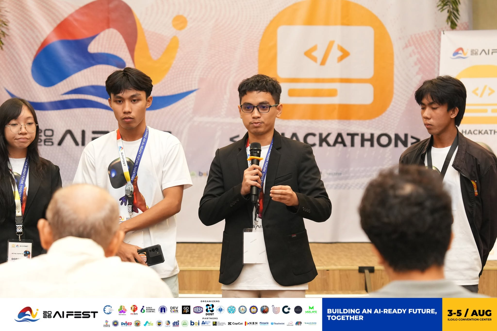

<div align="center">

# 👋 Hi, I'm Lenard Angelo.

### *I build software using the English language.*

*Sometimes I write Java.*  
*Most of the time, I explain what I want well enough that Java writes itself.*

> *Building products, leading communities, and shipping ideas with modern AI-assisted development.*

</div>

---

# 🚀 Highlights

- 👨‍💻 **Founder** of **ASU DevGuild** — a student-led developer community at Aklan State University.
- 🏆 Hackathon participant and project lead.
- 🌊 Building software that solves real-world problems.
- 📱 Full-stack developer focused on Flutter, FastAPI, and PostgreSQL.
- 🤖 AI-assisted developer who believes clear communication is an engineering skill.

---

# 💻 About Me

I'm a Software Engineering student from the Philippines with a passion for building products that make a real impact.

I enjoy taking an idea from a whiteboard sketch to a working application—designing the architecture, building the backend, crafting the user experience, and continuously improving it through iteration.

While many developers write code first and think later, I prefer to think first, describe the solution clearly, and use modern AI tools to accelerate implementation. To me, AI isn't a replacement for engineering—it's another tool that helps me spend more time solving problems and less time writing boilerplate.

At the end of the day, I still review the code, fix the bugs, make the architectural decisions, and take responsibility for everything I ship.

---

# 🛠 Tech Stack

### Languages


### Frameworks & Tools


---

# 🤝 Meet My Co-Workers

These teammates never ask for coffee breaks, but they occasionally hallucinate.

| Co-Worker | Specialty |
|-----------|-----------|
| 🤖 **ChatGPT** | System design, architecture, debugging, and explaining why my code broke. |
| 🧠 **Claude** | Long-form reasoning, documentation, and code reviews. |
| ⚡ **DeepSeek** | Fast implementations and algorithmic problem solving. |
| 🚀 **GitHub Copilot** | Autocomplete with suspicious amounts of confidence. |

> *The best engineers don't avoid great tools—they learn how to use them effectively.*

---

# ⚙️ My Development Workflow

```text
💡 Have an idea
        │
        ▼
📝 Describe it in English
        │
        ▼
🤝 Collaborate with my co-workers
        │
        ▼
👨‍💻 Review every line of code
        │
        ▼
🧪 Test and iterate
        │
        ▼
🚀 Deploy
        │
        ▼
🐞 Fix the bugs I definitely didn't create
        │
        ▼
🔁 Repeat
```

---

# 📜 Engineering Philosophy

> **Programming languages tell computers _how_.**
>
> **English explains _what_.**
>
> **Great software starts with communicating the problem clearly.**

Modern AI has changed how software is built, but not what makes software good.

Good engineering still requires thoughtful architecture, careful debugging, solid testing, and a deep understanding of the systems you're building.

AI helps me build faster.

Engineering helps me build better.

---

# 📈 Currently Exploring

- 🧠 Artificial Intelligence
- 📱 Cross-platform Mobile Development
- ⚡ Backend Engineering
- ☁️ Cloud Infrastructure
- 🛰️ IoT & Edge Computing
- 🗺️ Geospatial Applications

---

# ☕ Fun Facts

- 💬 I probably spend more time talking to AI than typing syntax.
- 🐛 Every bug is an opportunity to learn (or blame undefined behavior).
- 🚀 Shipping is a feature.
- 📖 Documentation is my favorite plot twist.
- 🎯 I enjoy turning ambitious ideas into working products.

---

<div align="center">

### *"Software is built twice: first in language, then in code."*

Thanks for stopping by! ⭐

</div>
