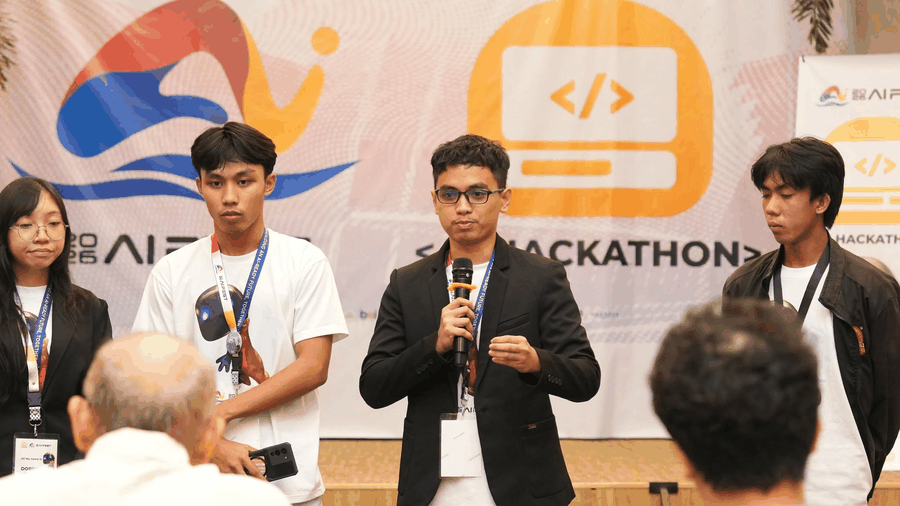

# 👋 Hi, I'm Lenard Angelo

<strong><em>I turn clear ideas into working software.</em></strong>

Software Engineering student from the Philippines building useful products, leading communities, and shipping with modern AI-assisted development.

<picture>
  <source media="(prefers-reduced-motion: reduce)" srcset="764938212_122183124626878900_3088215230800673996_n.jpg">
  
</picture>

Presenting projects at AI Fest, RSC, and KomsaiHack 2026.

## 🚀 Featured builds

### [🛟 AqOne](https://github.com/Aquanons/AIHackathon2026_Aquanons_AqOne)

An offline maritime safety network and AI-assisted search-and-rescue platform for municipal fishers operating beyond cellular coverage. Built by Team Aquanons for AI Fest 2026.

**Lead developer** — backend, architecture, and deployment. Authored **256 of 303 default-branch commits (84.5%)**, verified on August 31, 2026.

`Flutter` `FastAPI` `PostgreSQL` `scikit-learn` `ESP32` `LoRa`

| | |
|---|---|
| **[🗺️ Warang](https://github.com/len-build-it/Warang)** | **[🌊 Project Tabang](https://github.com/len-build-it/Project_Tabang)** |
| An offline-first map of your own photographs. Capture a moment and rediscover it by place—without accounts, feeds, or uploaded memories. | A flood reporting and response app for Aklan, connecting residents, responders, and reviewers during emergencies. |
| `Flutter` `Riverpod` `Drift` `SQLite` `OpenStreetMap` | `React` `Firebase` `Cloudinary` `Node.js` |

## 👨‍💻 About me

I'm a Software Engineering student who enjoys taking an idea from a whiteboard sketch to a working product—planning the architecture, building the backend, crafting the experience, and improving it through real feedback.

I'm also the founder of **ASU DevGuild**, a student-led developer community at Aklan State University. I use AI to accelerate implementation, but I still review the code, make the engineering decisions, test the result, and take responsibility for what ships.

## 🏆 Building in public

- Founded **ASU DevGuild** to help students learn and build together.
- Lead developer of **[AqOne](https://github.com/Aquanons/AIHackathon2026_Aquanons_AqOne)**, an AI-assisted maritime safety platform built for AI Fest 2026.
- Lead and present projects at hackathons and technology events.
- Built **Project Tabang** for KomsaiHack 2026, placing 7th among more than 25 teams.
- Explore mobile development, backend systems, cloud infrastructure, IoT, and geospatial applications.

## 🛠 Technology

## ⚙️ How I build

`Idea` → `Describe it clearly` → `Build with AI` → `Review` → `Test` → `Ship` → `Repeat`

## 📜 Engineering philosophy

> **Programming languages tell computers _how_.** 
> **English explains _what_.** 
> **Great software starts with communicating the problem clearly.**

AI helps me build faster. Engineering judgment decides what ships.

<strong>🤝 Meet my AI co-workers</strong>

| Co-worker | Specialty |
|---|---|
| **ChatGPT** | System design, architecture, and debugging |
| **Claude** | Documentation and code review |
| **DeepSeek** | Fast implementation and algorithms |
| **GitHub Copilot** | In-editor assistance and autocomplete |

## 📫 Let's connect

I'm interested in useful products, community-driven technology, and ambitious ideas that deserve to become real software.

**[Explore my repositories →](https://github.com/len-build-it?tab=repositories)**

<strong><em>“Software is built twice: first in language, then in code.”</em></strong>

Thanks for stopping by! ⭐

