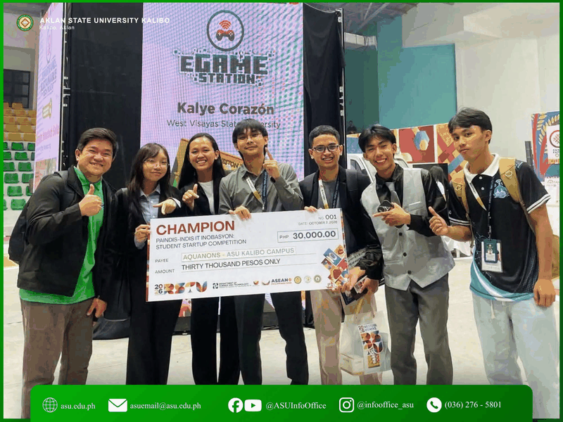

<picture>
  <source media="(prefers-reduced-motion: reduce)" srcset="764938212_122183124626878900_3088215230800673996_n.jpg">
  
</picture>

Presenting, prototyping, and community building across AI Fest, Enactus Philippines, New Energy Nexus, ASU DevGuild, CCS Programming Competition, KomsaiHack, and DICT.

# 👋 Hi, I'm Lenard Angelo

<strong><em>I use generative AI in my development process to build real-world solutions.</em></strong>

Aspiring **Generative AI Specialist** and Software Engineering student from the Philippines.

Startup founder of **Aquanons**, building **AqOne**.

## 🚀 Featured builds

### [🛟 AqOne](https://github.com/Aquanons/AIHackathon2026_Aquanons_AqOne)

An offline maritime safety network and AI-assisted search-and-rescue platform for municipal fishers beyond cellular coverage.
Built by Team Aquanons for AI Fest 2026, advancing to the **Top 60 nationwide** (out of 200+ entries) in Enactus Philippines 2026.

**My role:** Founder and lead developer for backend, architecture, and deployment.

`Flutter` `FastAPI` `PostgreSQL` `scikit-learn` `ESP32` `LoRa`

---

### [🗺️ Warang](https://github.com/len-build-it/Warang)

An offline-first map for organizing and rediscovering your photos by place, without accounts, feeds, or uploads.

`Flutter` `Riverpod` `Drift` `SQLite` `OpenStreetMap`

---

### [🌊 Project Tabang](https://github.com/len-build-it/Project_Tabang)

A flood reporting and response app for Aklan, connecting residents, responders, and reviewers.

`React` `Firebase` `Cloudinary` `Node.js`

## 👨‍💻 About me

I enjoy planning architecture, building backends, crafting user experiences, and improving products through real feedback. My interests span mobile development, cloud infrastructure, IoT, and geospatial applications.

I also founded **ASU DevGuild**, a student-led organization at Aklan State University, pairing over 30 aspiring developers with two experienced mentors.

## 🏆 Building in public

- **1st place** at the CCS ICT Days Programming Competition.
- Built **Project Tabang** for KomsaiHack 2026, placing 7th among more than 25 teams.
- Led and presented projects at hackathons and tech events, including New Energy Nexus and RSC.
- Completed **DICT Region VI** Python Programming Essential Training.

## 🛠 Technology

## ⚙️ How I build

`Real problem` → `Prototype with AI` → `Review` → `Test` → `Ship`

Across my projects, I use generative AI during development to prototype solutions.
I review AI-assisted code, test the result, and take responsibility for what ships.

I'm interested in exploring how AI could add value inside future product features.

## 📫 Let's connect

I'm interested in useful products, community-driven technology, and ambitious ideas that deserve to become real software.

**[Explore my repositories →](https://github.com/len-build-it?tab=repositories)**

Thanks for stopping by! ⭐

